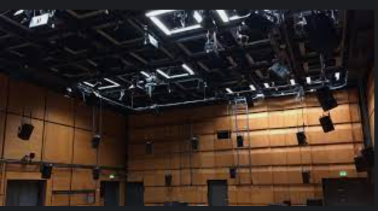
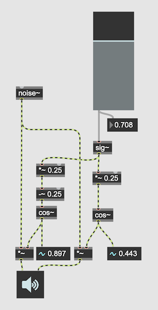
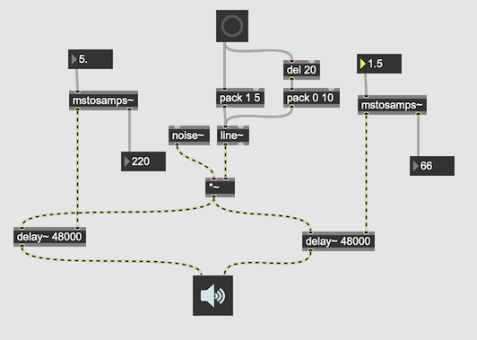
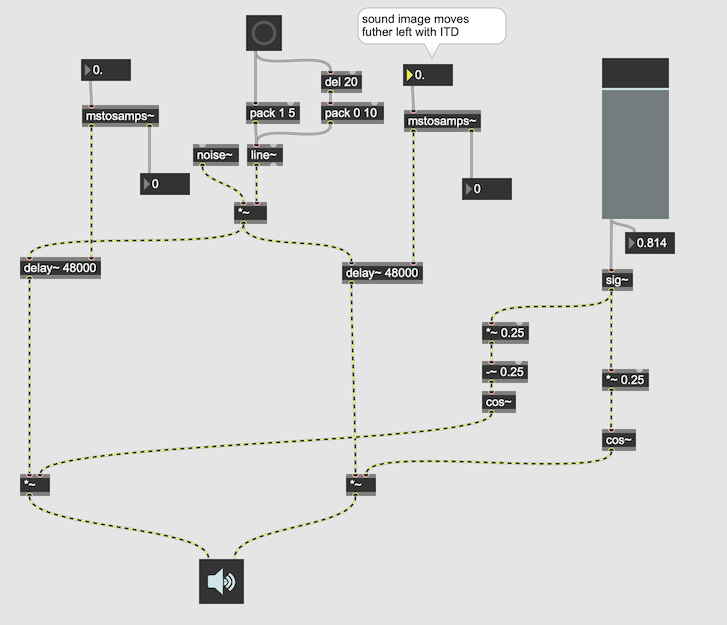
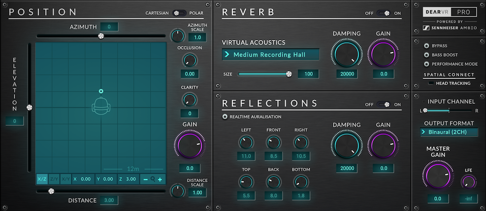
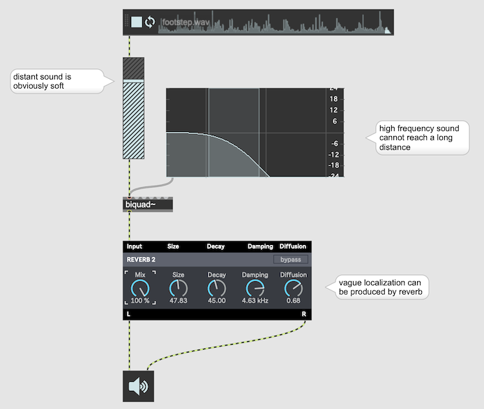
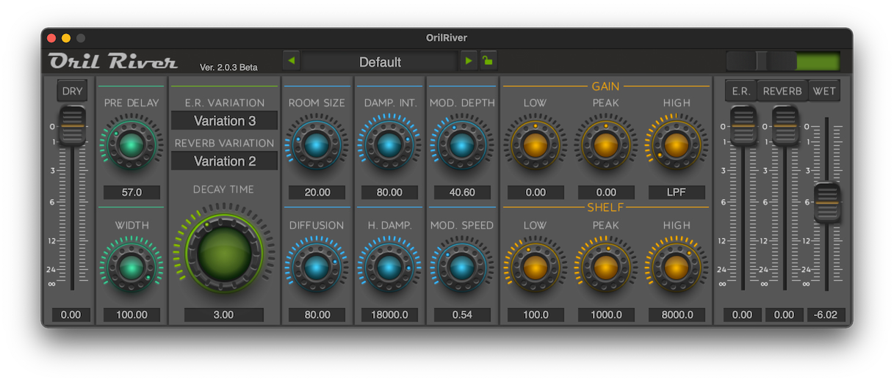
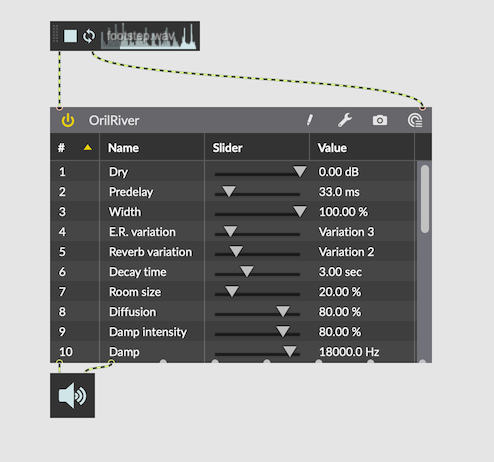
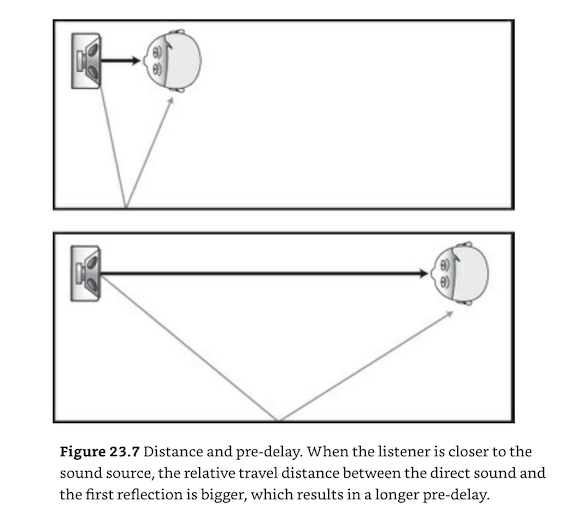
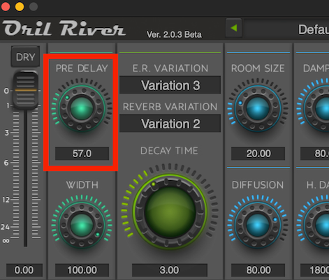

# 1 3D Sound

## Overview of this semester

- Human Perception of 3D Sound
- Impulse Response and Convolution
- Binauralization - HRIR and SOFA
- Ambisonics and its tools
- Ambisonics and binauralization
- Designing Spatial Movement
- Head Tracking / youtube VR and spatial sound
- Projects

## What is 3D Sound

Many interpretations are possible

- Audio experience realized by 3D surround speaker set up such as ZKM-Kubus
- Audio experience with headphones with the simulation of sound sources placed in a virtual 3D space (as in VR/AR experience)

## Human perception of 3D Sound (Binaural Cues)

### Left and Right

#### ILD (Interaural Level Difference)

##### Linear Panning

##### Equal Power Panning

#### ITD (Interaural Time Difference)

- distance between the 2 ears of approximately 22–23 cm
- The speed of sound at 20 celsius = 343 meters/s

22 / 34300 = 0.0006413994169 s = 0.64139 msec
0.0006413994169 * 48000 = ca' 31 samples delay where SR = 48k

#### ITD + ITD

### Front-Back / Top-Bottom

#### HTRF ... Head Related Transfer Function

A head-related transfer function (HRTF) is a response that characterizes how an ear receives a sound from a point in space. As sound strikes the listener, the size and shape of the head, ears, ear canal, density of the head, size and shape of nasal and oral cavities, all transform the sound and affect how it is perceived, boosting some frequencies and attenuating others.

Our head functions as a filter and change the color of the source sound. Our brain assumes the position of source by the filtered color of the source sound.

#### Binauralization

Simulates a sound from a specific point in the space by simulating the HRTF by artificial filters.

dearVR Pro (Dear Reality GmbH)

### Distance

The characteristics of "far" sound

- softer
- vague localization
- reduced high frequency 

#### Footstep practice

[Footstep Sound](https://freesound.org/people/InspectorJ/sounds/336598/)

By combining attenuation + Lowpass + reverb, we can fake a distant sound.

### The perception of 3D space = room size and reverb tricks

  
Mixing Audio by Roey Izhaki

[Oril River Free Reverb](https://www.kvraudio.com/product/orilriver-by-denis-tihanov)

  
oril river loaded on Max

Three important cues
- Pre delay time 
Pre-Delay is he time difference between the arrival of the direct sound and that of the very first reflection. It gives us a certain clue to the size of the room; in the larger rooms the pre-delay is longer as it takes more time for reflection to travel to the boundaries and back to the listener.
  

The closer the source to the listener, the longer the pre-delay. This is due to the fact that the relative distance between the direct and the reflected sounds is getting smaller.

- Early reflections Level

The level of the early reflections suggests how big the room is - a bigger room will have its boundaries father away from the listener and thus bounced reflections will travel longer distances and will be quieter.

Although the farther away the listener is from the sound source the longer distance the reflected sound travels, it is the difference in distances travelled between the direct, and the reflected sounds that matters here - a close sound source will have a very short direct path, but a long reflected path.

[Examples Mixing Audio](K1/mixing_audio)
