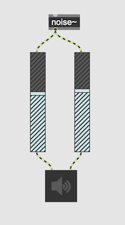
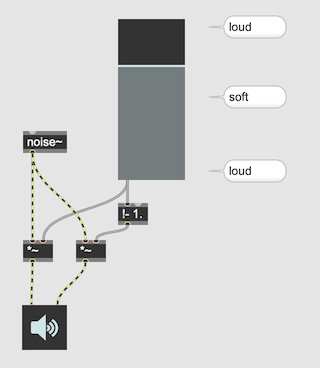

#1 3D Sound

## Overview of this semester

- Human Perception of 3D Sound
- Impulse Response and Convolution
- Binauralization - HRIR and SOFA
- Ambisonics and its tools
- Ambisonics and binauralization
- Head Tracking
- Projects

## Human perception of 3D Sound (Binaural Cues)

### Left and Right

#### ILD (Interaural Level Difference)

##### Linear Panning

##### Equal Power Panning

#### ITD (Interaural Time Difference)

- distance between the 2 ears of approximately 22–23 cm
- The speed of sound at 20 celsius = 343 meters/s

22 / 34300 = 0.0006413994169 s = 0.64139 msec
0.0006413994169 * 48000 = ca' 31 samples delay where SR = 48k

#### ITD + ITD

### Front-Back / Top-Bottom

#### HTRF ... Head Related Transfer Function

A head-related transfer function (HRTF) is a response that characterizes how an ear receives a sound from a point in space. As sound strikes the listener, the size and shape of the head, ears, ear canal, density of the head, size and shape of nasal and oral cavities, all transform the sound and affect how it is perceived, boosting some frequencies and attenuating others.

Our head functions as a filter and change the color of the source sound. Our brain assumes the position of source by the filtered color of the source sound.

#### Binauralization

Simulates a sound from a specific point in the space by simulating the HRTF by artificial filters.

dearVR Pro (Dear Reality GmbH)

### Distance

The characteristics of "far" sound

- vague localization
- softer
- reduced high frequency

#### Footstep practice

### Occlusion

### The size of room

