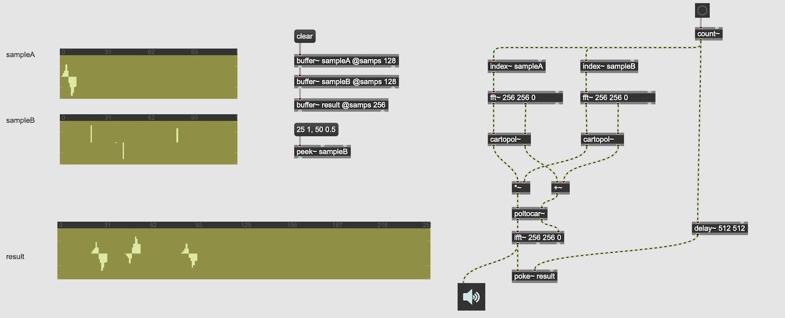

#2 Convolution and HRTF

## Impulse Response

In signal processing, the impulse response, or impulse response function (IRF), of a system is its output when presented with a brief input signal, called an impulse.

## Impulse Response of known effects

### Highpass Filter

### Feedback delay

### Your Laptop's speaker and microphone

## Convolution Theory

### Time Domain Convolution (Buffer-based)

### Realtime Time Domain Convolution

### FFT Convolution

### HIRT (HISS Impulse Response) Tool

[HIRT](http://eprints.hud.ac.uk/id/eprint/14897/)

#### buffer-based convolution 

#### realtime convolution

#### IR manipulation

## Convolution Reverb

### Apple Space Designer

Input signal is convolved with a sampled IR. This creates very realistic and natural reverb sound, compared to algorithmic reverb effects.

### Convolution Reverb in Max

[OpenAIR](https://www.openairlib.net/) ... a free IR sample library

