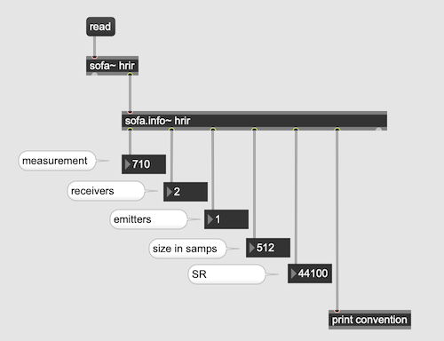
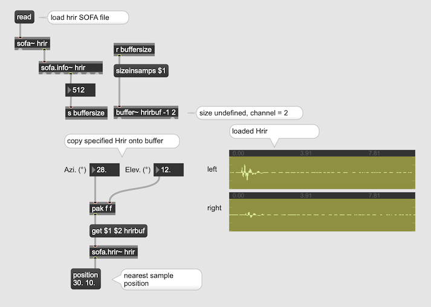
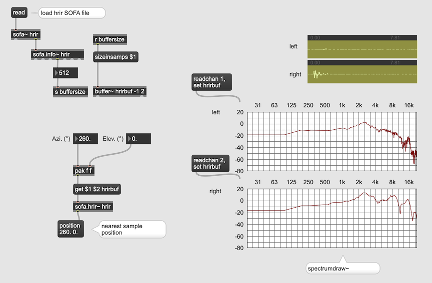
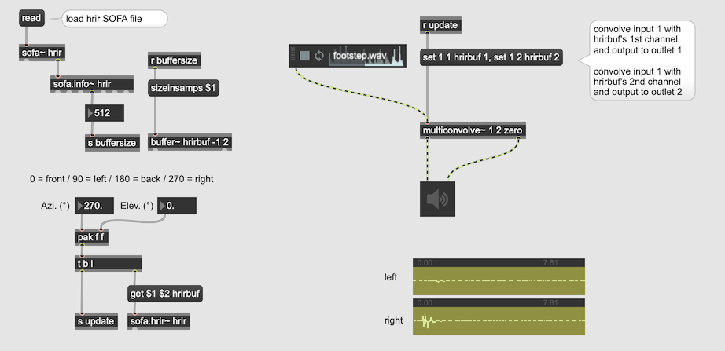

# 3 Convolution and HRTF

## HRTF

HRTF ... Head Related Transfer Function

HRTF characterizes how an ear receives a sound from a point in space. As sound strikes the listener, the size and shape of the head, ears, ear canal, density of the head, size and shape of nasal and oral cavities, all transform the sound and affect how it is perceived, boosting some frequencies and attenuating others. Obviously, the HRTF varies person to person.

## Dummy head

enables us to record very realistic spatial sound because dummy head simulates ITD, ILD, and HRTF. 

  
Neuman KU100

### Example 

Virtual Barbershop  
[Youtube](https://www.youtube.com/watch?v=IUDTlvagjJA)

Hellblade  
[Youtube](https://youtu.be/gFdPXCzxMg8?t=168)
[Youtube](https://youtu.be/5-D57571odo?t=165)

## HRIR 

HRIR ... Head Related Impulse Response

Usually a set of impulse response data that represents how an impulse in modified by head by reaching the ear canals. The HRTF is the Fourier transform of HRIR.  

  
An example of HRIR Recording Setup with a dummy head in an anechoic chamber. The dummy-head holder rotates the dummy-head little by little to sample the impulse responses coming from different angles.

## The problem or HRIR data

HRIR data consists of a large set of small  stereo IR samples. 
If we samples every 5 degrees horizontally and vertically (360/5) * (180/5) = 2592 stereo files.
Usually this process is repeated for different sample rate such as 44100, 48000, 96000 etc. it easily exceeds 10000 samples. 
Each sample should be coupled with proper meta data (SR/Azimuth/Elevation/DummyHeadType/Distance/Recording Studio etc.)

It's hard to use normal wav or aiff files for this purpose.

## The SOFA file

SOFA ...Spatially Oriented Format for Acoustics

SOFA is a file format for storing spatially oriented acoustic data like head-related transfer functions (HRTFs) and binaural or spatial room impulse responses (BRIRs, SRIRs). SOFA has been standardized by the Audio Engineering Society (AES) as AES69-2015. 

### Free SOFA database

Some SOFA files are available online
[sofaconventions](https://www.sofaconventions.org/mediawiki/index.php/Files)

## How to use SOFA Data in Max

Special external object is available   
[SOFA for Max](https://github.com/APL-Huddersfield/SOFA-for-Max/releases/tag/0.3.2)

### Loading Sofa file

[Example Sofa file](K3/mit_kemar_large_pinna.sofa)

sofa.info~ reveals its meta data

### Loading Hrir data

### Check Frequency Response of HRIR

### Convolve Hrir in frequency domain 

