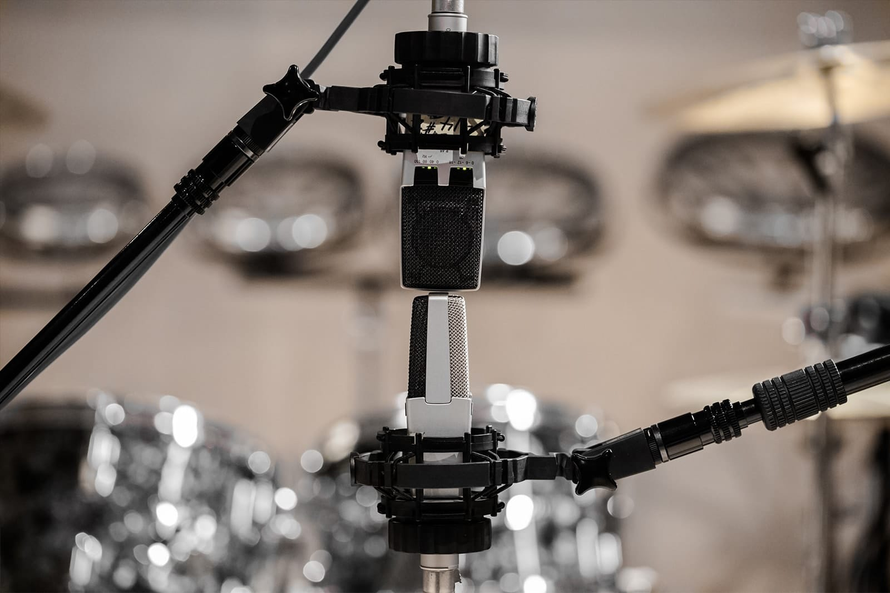
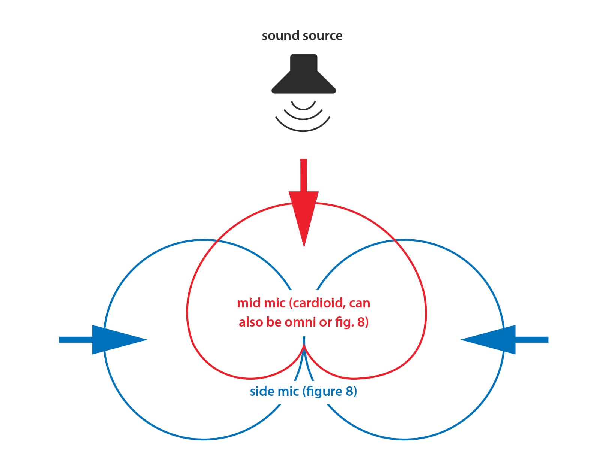
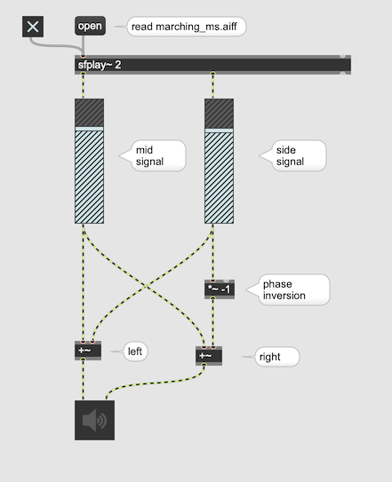
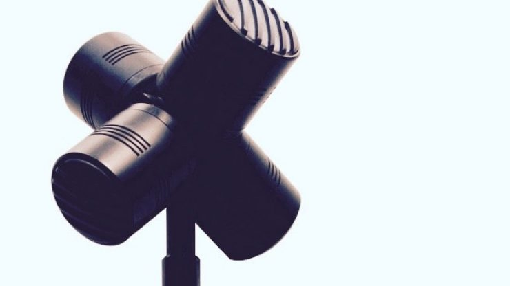
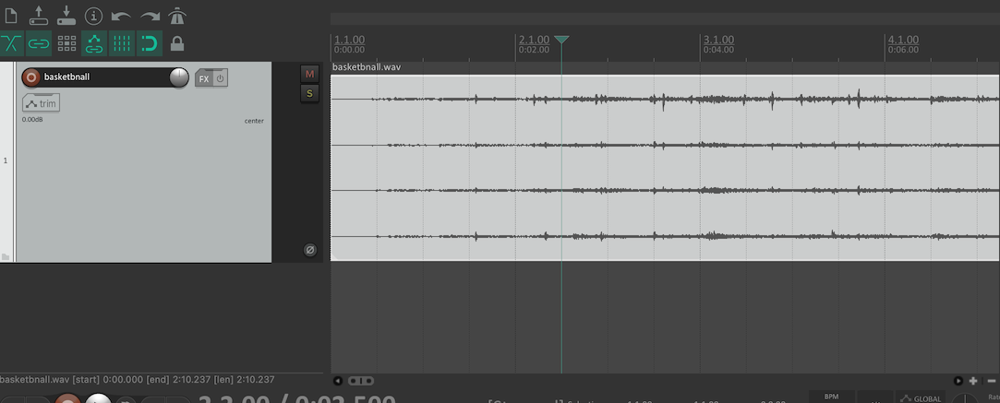
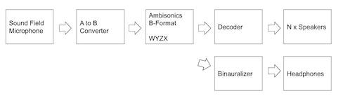
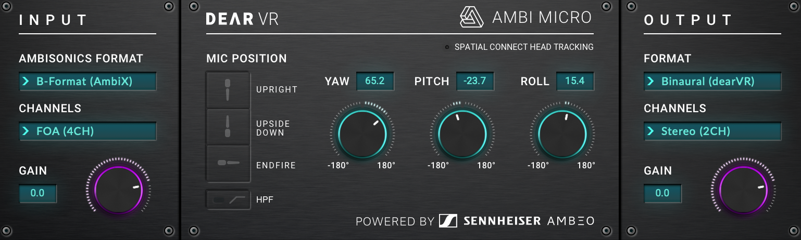
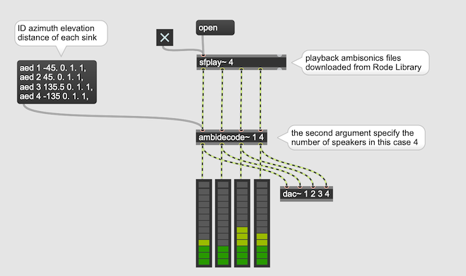
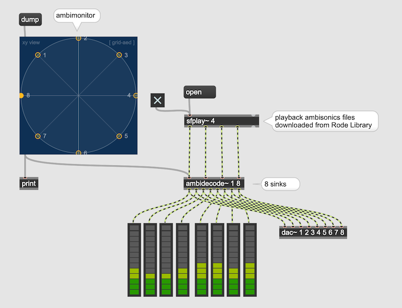

#4 Ambisonics 1

## MS (Mid-Side) Recording Technique

Mid ... Cardioid or Omni  
Side ... Figure of Eight  

## MS Decoder

## Sound Filed Microphone

[Rode NTSF1](https://rode.com/microphones/ntsf1)

can record 4 channels of signal that represents 3D version of MS recording.

### Ambisonics B-Format 

W ... Omni Microphone    
X ... Figure of Eight (pointing forward)  
Y ... Figure of Eight (pointing left)  
Z ... Figure of Eight (pointing up)  

    Sound Field microphone consists of actually 4 cardioid microphones and record sounds in Ambisonics A-Format but it can be converted to B-Format  

### AmbiX vs. FuMa

There are two conventions of Ambisonics B-Format AmbiX and Fuma.

Chanel Arrangement  
Ambix : WYZX (More Popular)  
Fuma: WXYZ

### Ambisonics Sounfiles

[Rode Ambisonics Sound Library](https://library.soundfield.com/)
All B-Format file (First Order)

Ambisonics file loaded onto DAW.   
There is no difference between 4 channel sound file and ambisonics sound file. However, you cannot listen to it without a proper decoding or binauralization.

### Listening to Ambisonics 

#### with Headphones + Binauralization

[dearVR AmbiMicro](https://www.dear-reality.com/products/dearvr-ambi-micro) 

- Free
- can binauralize Ambisonics (Fuma/AmbiX) upto 3rd order
- 4 different types of HRTF
- Head Rotation can be also simulated

#### Surround Speaker System

#### with Max
[ICST Ambisonics External Plugin](https://www.zhdk.ch/forschung/icst/software-downloads-5379/downloads-ambisonics-externals-for-maxmsp-5381)

##### 4 channel speaker decoding

sink ... a 3D point in the virtual sound field to be used for decoding. Usually these points coincide with the speakers in the real world. 

#### 8 channel speaker decoding

