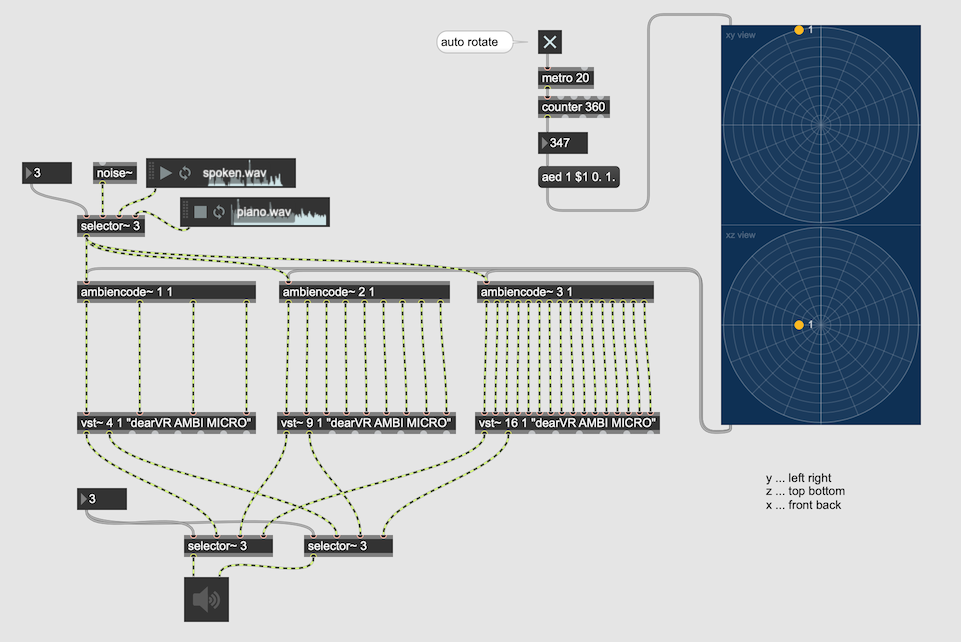
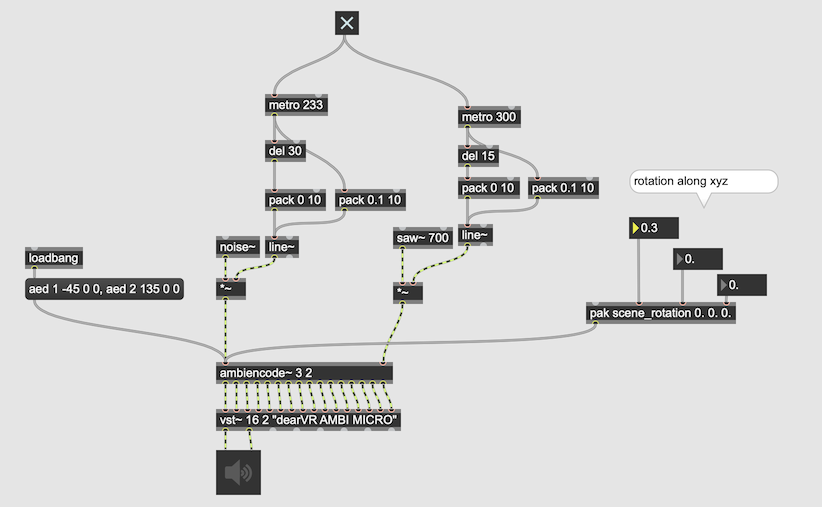

#5 Ambisonics 2

### Ambisonics Encoding 

Ambisonics audio can be realized by using Sound Field Microphone but it is also possible to encode a mono sound stream to Ambisonics and manipulate the position of the source.

### 3D Encoding

### Coordinate system

ICST ambisonics external objects use the following coordinate system

Note: many papers about Ambisonics use mathematical coordinate system that is different from this one

### Is localization convincing?

Simply test the localization with dearVRAmbi Micro

### Higher Order Ambisonics

- FOA ... First Order Ambisonics (4 channels)
- SOA ... Second Order Ambisonics (9 channels)
- TOA ... Third Order Ambisonics (16 channels)

Number of channels required = (1 + Order) ^ 2 
7th order ambisonics requires (1+7) ^ 2 = 64 channels

The higher the order, the better the spatial resolution. 

#### Comparing FOA vs SOA vs TOA

### More than one sources

We can simply change the argument of ambiencoder

### Mix with recorded ambisonics

#### mc object reduces the number of patch cords

### mixing streams with different ambisonics order

### Mid-Side technique in Ambisonics

### SceneRotation
rotate the entire scene

### Distance Attenuation

Distance Attenuation means how the distance between the source and the listener reduce the level of the source. This setting largely influence the sound scape (Also in the 3D gaming audio design the configuration of this parameter is one of the main subjects among the game audio designer ). 

### Simulate Air Absorption

