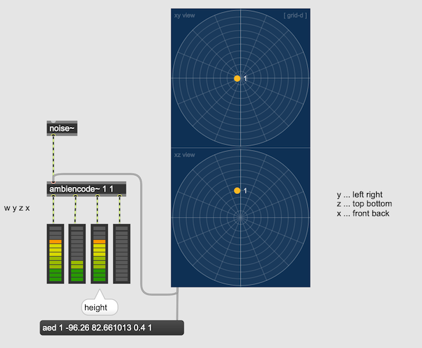

#5 Ambisonics 2

### Ambisonics Encoding 

Ambisonics audio can be realized by using Sound Field Microphone but it is also possible to encode a mono sound stream to Ambisonics and manipulate the position of the source.

### 3D Encoding

### Is localization convincing?

Simply test the localization with dearVRAmbi Micro

### Higher Order Ambisonics

- FOA ... First Order Ambisonics (4 channels)
- SOA ... Second Order Ambisonics (9 channels)
- TOA ... Third Order Ambisonics (16 channels)

Number of channels required = (1 + Order) ^ 2 
7th order ambisonics requires (1+7) ^ 2 = 64 channels

The higher the order, the better the spatial resolution. 

#### Comparing FOA vs SOA vs TOA

### More than one sources

### Mix with recorded ambisonics

### Mixing sources with different order

### Mid-Side technique again

### Manipulation

