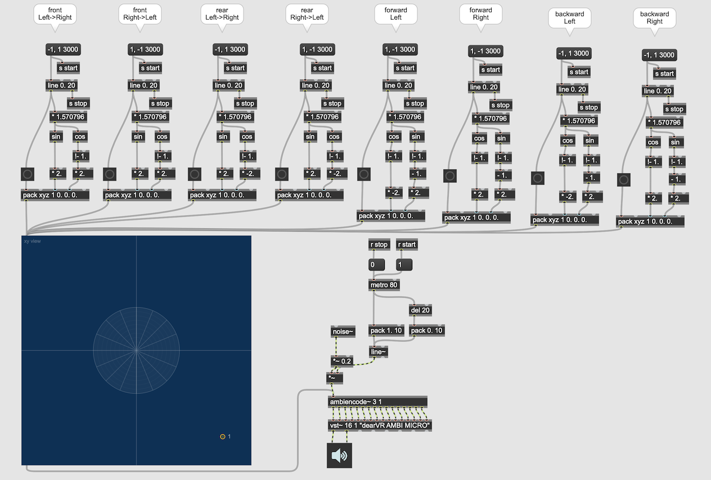

# 6 Designing source movement 1

On Sonic Art  Chapter 10 - Spatial Motion introduces a list of movement that we can use in our composition.

### Front/Rear Asymmetry
There is a slight difference in quality between the same sound heard from in front of the head and from behind the head. The orientation of the pinna and masking effects of the head itself tends to mean that mos sounds are heard most clearly when we turn our face towards them.

More important, however, in its natural environment, on hearing a sound an animal or bird will orient its face towards the direction from which the sound comes in order to be able to see the source of the sound. In te case of a sound coming from in front the creature will have probably seen the source of the sound before the sound is heard but this is not the case with sound s coming from behind. Such sounds, therefore, tend to be more stressful, mysterious or frightening.

## Direct Motion

### Straight line motion

#### Center-crossing

#### Edge-hugging

Paths which pass through the listener's head is perceptually quite clear. Paths that pass along the edge of the space is more difficult to perceive (Distance cue is only hint for perceiving this).

### Center-crossing arc motions

Center-crossing arc motion that pass through the listener's head will be clearly distinguishable from straight paths.

### Diagonal paths

The paths move simultaneously along the lef-right and front-back axes are called diagonal paths. Seven types of diagonal motion can be clearly distinguishable. 

### Center-hugging diagonal paths

A set of diagonal paths which arc though the listener's head.

mc.function is utilized to store xy movement.

### UI problem of 3D trajectory

dearVRPro's 3D source movement is displayed as 3 lanes of automation curve on a DAW software. It's very hard to grasp what kind of movement it is for us.

### Break point approach
We set the 3D positions of the spatial source at several specific points in the timeline and let the system interpolate them.

### Centering / De-centering

### Centering Arc

The spatial impression is quite different depends on the curvature. 

