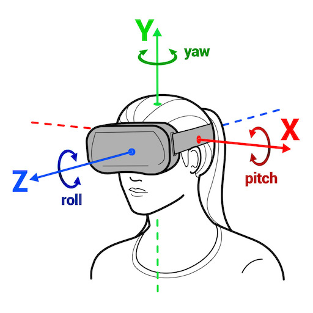
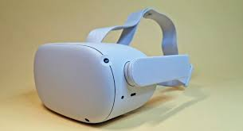

#7 Head-Tracking

If the sound source is in front of you and your if turn right, the sound should be heard from your left. In order to create a virtual sound scale, it is important that the positions of sound rotate relative to your head movement.

VR HMD (Head Mount Displays) detects the rotation of the head and changes the sight and rotate the soundscape accordingly.

### Example of hardware that detect head-rotation
VR HMD (Oculus Quest 2)  

Cell Phone VR

Headphone Attachment

[Redscape Audio](https://www.redscapeaudio.com/)

### Simulate Head Tracking

