# 7 Designing source movement 2

## Cyclical and oscillatory Motions

Cyclical motion types
- Central (listener-centric circle)
- Peripheral (the listener is outside the circle)
- Eccentric (the listener is in the circle)

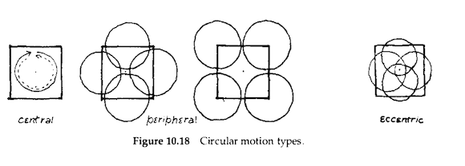

Because left-right/front-back cues are much more reliable than distance cues, circular motion is most easily recognized when it passes right around the head of the listener (central circular motion).

Circular motion which does not do this is more difficult to establish in the listener's perception.

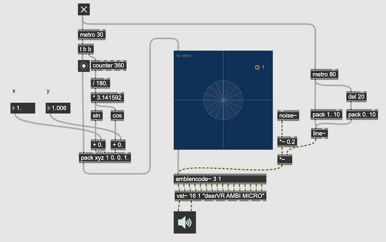

#### Perception of cycle vs closed polygon

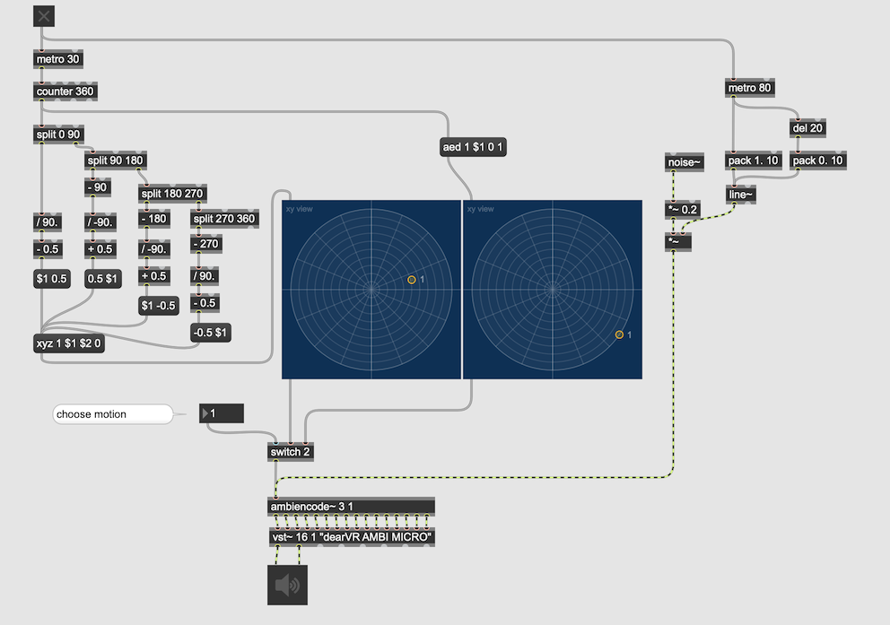

Distinguishing the polygon from motion along an arc will be quite difficult.

### Oscillation

To take any direct motion and retrace the path in the opposite direction.

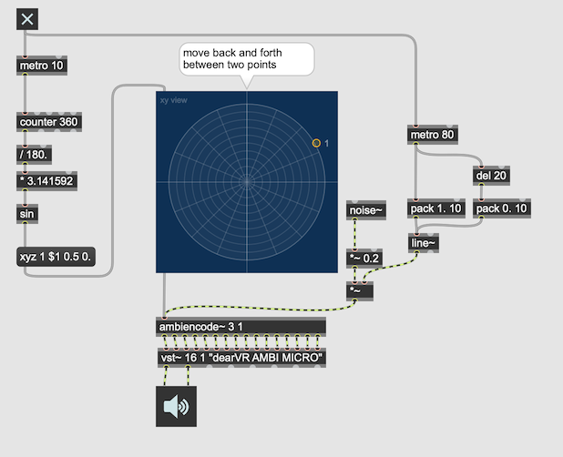
#### Interpolation between Cyclic Motion and oscillation

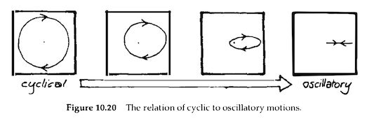

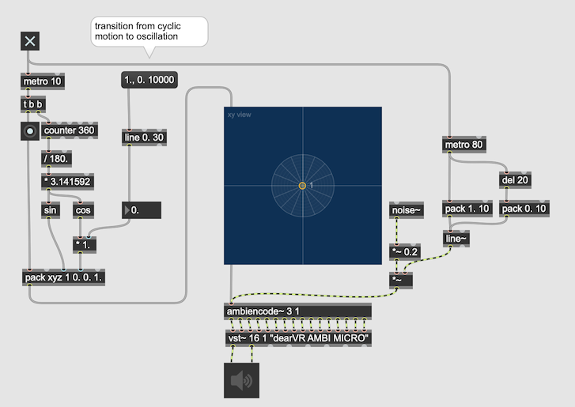

### Spiral motion

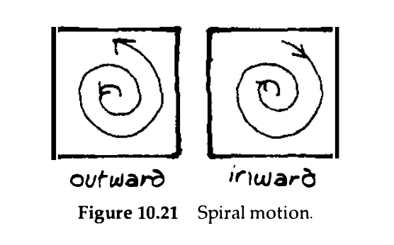

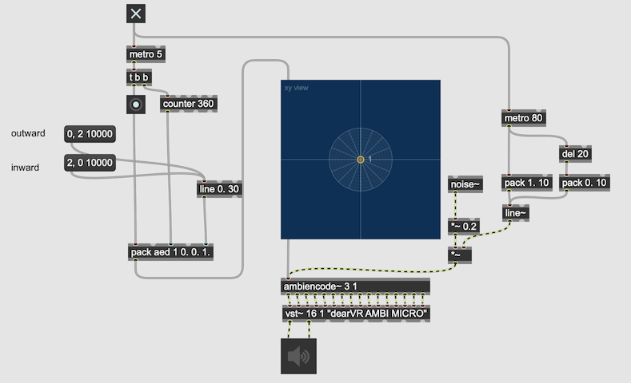

### Spiral out
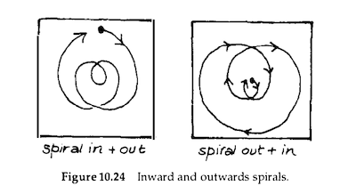

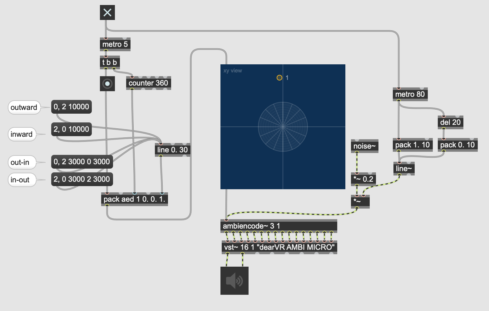

### Shallow Spiral
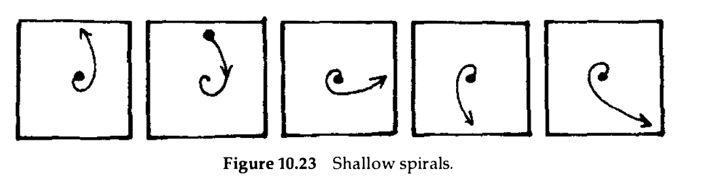

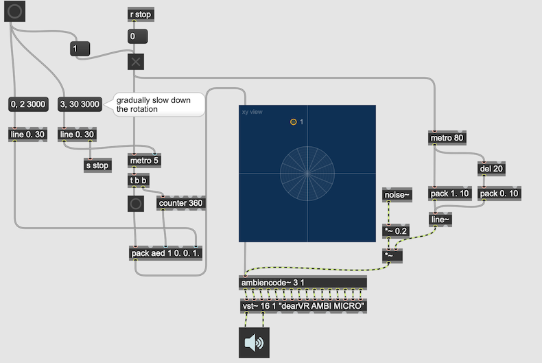

### Figure of eight
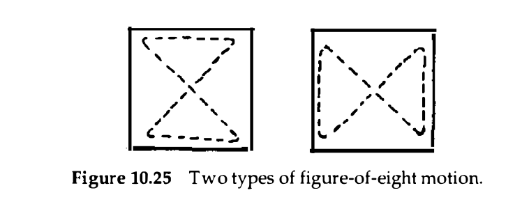

## Double Motion

### Zigzag
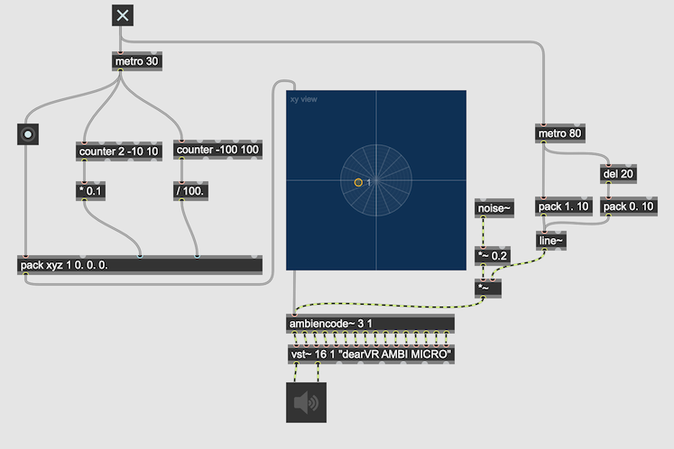

### Zigzag Oscillation
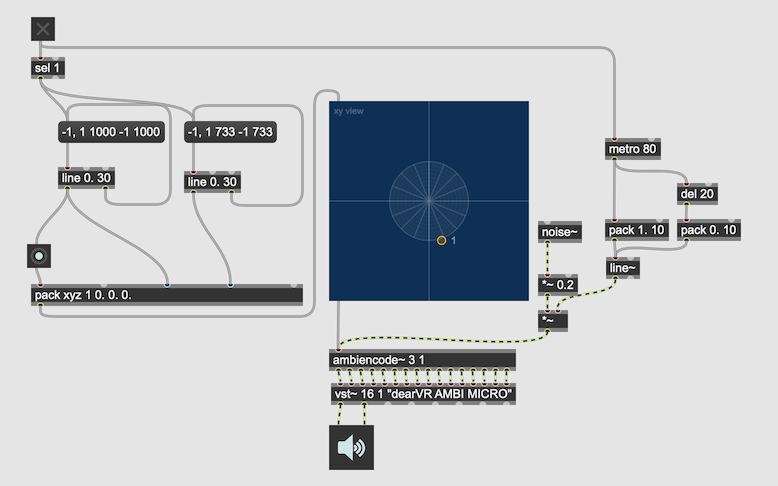

### Circle + ellipse
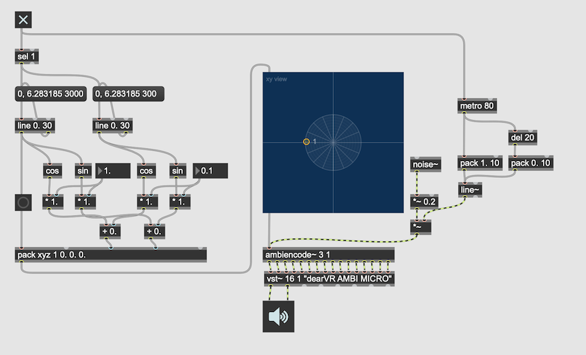

## Irregular Motion

### Unlocalized
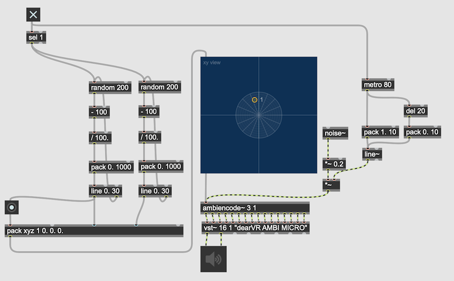

### localized
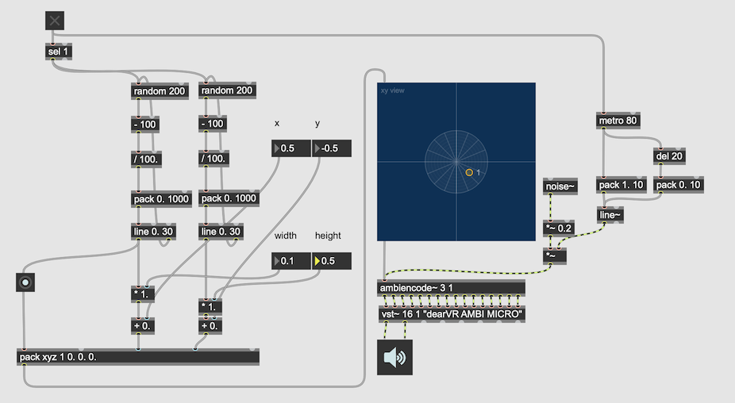

### with weight 
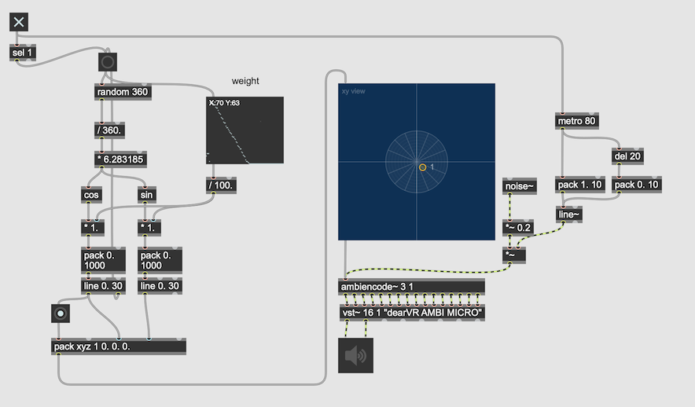

