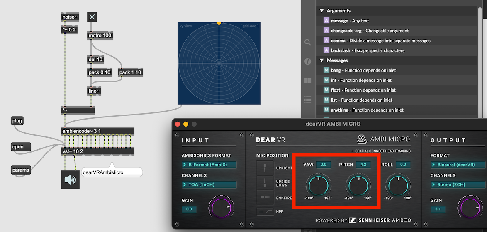

#7 FaceBook 360

### Head-Tracking

VR HMD (Head Mount Displays) detects the rotation of the head and changes the sight and rotate the soundscape accordingly.

### Example of hardware that detect head-rotation
VR HMD (Oculus Quest 2)  

Cell Phone VR

Headphone Attachment

[Redscape Audio](https://www.redscapeaudio.com/)

### Simulate Head Tracking

Free IR library  
[OpenAIR](https://www.openairlib.net/)

