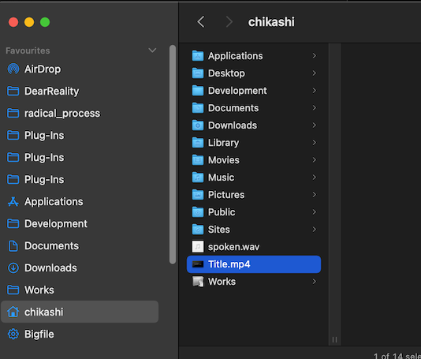
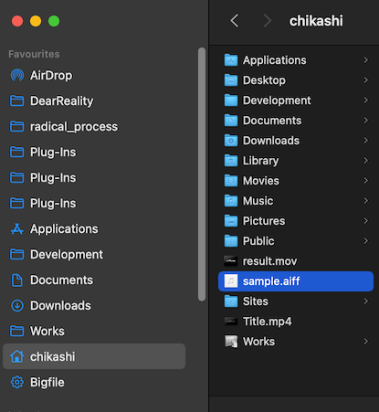
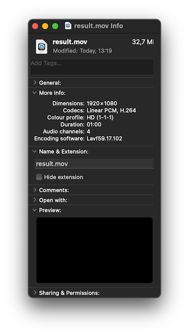
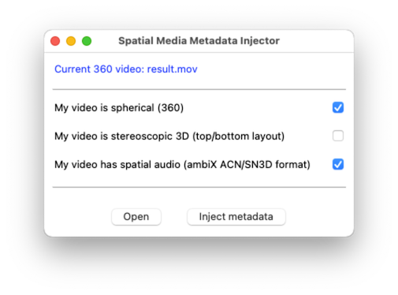

# 9 Towards the final project

### Using Ambisonics in DAW

### Head-Tracking

If the sound source is in front of you and your if turn right, the sound should be heard from your left. In order to create a virtual sound scale, it is important that the positions of sound rotate relative to your head movement.

VR HMD (Head Mount Displays) detects the rotation of the head and changes the sight and rotate the soundscape accordingly.

### Example of hardware that detect head-rotation
VR HMD (Oculus Quest 2)  

Cell Phone VR

Headphone Attachment

[Redscape Audio](https://www.redscapeaudio.com/)

### Simulate Head Tracking

### Final Assignment: Spatial audio installation on youtube VR

In this assignment you will create a generative sound installation in Max using Ambisonics and export a one-minute excerpt from it and publish it online.

- The work should be available on Youtube before the presentation day 
- Your YouTube Video should be with 3D spatial audio feature enabled   
- the YouTube video's visual part should only contain the [provided video](https://drive.google.com/file/d/1zqUMfAkjkPj4V1Or7rvd6LmaJ7XdzobN/view?usp=sharing)
    - the youtube video's audio part should contain 1st order ambisonics sound track excerpted from your installation
    - Do not use Head-Locked Stereo
    - The video should be at least 1 min

- Due date: July. 4. 2022

## Youtube 360 Video demo

[360 Video with spatial audio](https://www.youtube.com/watch?v=-vEZmHpGD08)

### How to create your Video

1. Download [FFMpeg](https://evermeet.cx/ffmpeg/) and install
2. Download [Spatial Media Meta Data Injector](https://github.com/google/spatial-media/releases)
3. Download [Placeholder movie "Title.mp4"](https://drive.google.com/file/d/1zqUMfAkjkPj4V1Or7rvd6LmaJ7XdzobN/view?usp=sharing)
4. Export FOA Ambisonics sound file from Max or use [Placeholder audio "Sample.aiff"](https://drive.google.com/file/d/13FJesahR_FoWfBhgxWqfdrdxa_FZHHCS/view?usp=sharing)
5. Place both Title.mp4 file and your ambisonics sound file or the placefolder sample.aiff under your home directory (e.g. /Users/chikashi)
   

6. Execute following command line (copy & paste this and hit return key)
> ffmpeg -i Title.mp4 -i sample.aiff -channel_layout 4.0 -c:v copy -c:a copy result.mov

this command merge your video (=Title.mp4) and your audio (=sample.aiff) to result.mov using 4 channel audio layout

7. make sure that result.mov has 4 channel audio

8. Launch Spatial Media Metadata injector. 
9.open result.mov and check the following two items
  - My Video is spherical (360)
  - My video has sptial audio (ambiX ACN/SN3D format)

10. hit inject metadata and generate new file with meta data
11. Upload the generated file to youtube