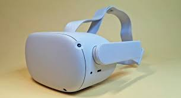
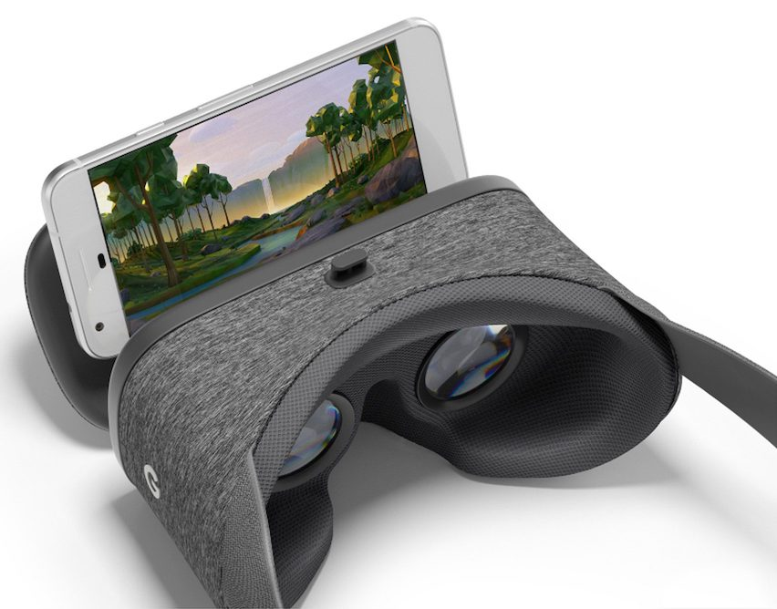
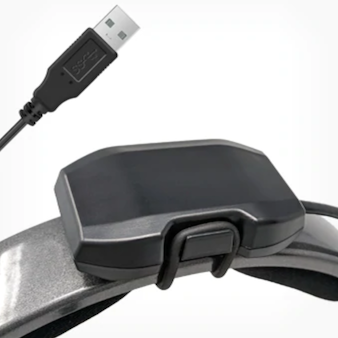
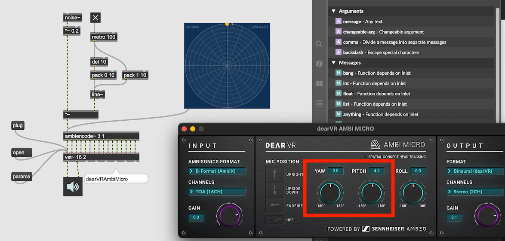

#9 Towards the final project

### Using Ambisonics in DAW

### Head-Tracking

If the sound source is in front of you and your if turn right, the sound should be heard from your left. In order to create a virtual sound scale, it is important that the positions of sound rotate relative to your head movement.

VR HMD (Head Mount Displays) detects the rotation of the head and changes the sight and rotate the soundscape accordingly.

### Example of hardware that detect head-rotation
VR HMD (Oculus Quest 2)  

Cell Phone VR

Headphone Attachment

[Redscape Audio](https://www.redscapeaudio.com/)

### Simulate Head Tracking

### Final Assignment :
Spatial audio installation/composition on youtube VR

You can choose your final assigment from the following two options:
1. create a generative spatial sound installation in Max
2. create a short (min 1 min.) spatial piece using DAW 

In both cases:
- The work should be available on youtube before the presentation 
- Your Youtube Video should be with 3D spatial audio feature enabled   
- the youtube video's visual part should only contain the provided video below
    - the youtube video's audio part should contain 1st order ambisonics sound tracks excerpted from your installation
    - Do not use Head-Locked Stereo
    - the video should be exactly 1 min

- Due date: July. 4. 2022

## Youtube 360 Video demo

[360 Video with spatial audio](https://www.youtube.com/watch?v=-vEZmHpGD08)

### How to create your Video

1. Download [FFMpeg](https://evermeet.cx/ffmpeg/) and install
2. Download [Spatial Media Meta Data Injector](https://github.com/google/spatial-media/releases)
3. Open Terminal
4. execute following command line
> ffmpeg -i Title.mp4 -i noise_rotation_foa.wav -channel_layout 4.0 -c:v copy -c:a copy test.mov
5. Launch metadata injector and inject meta data
6. Upload to youtube